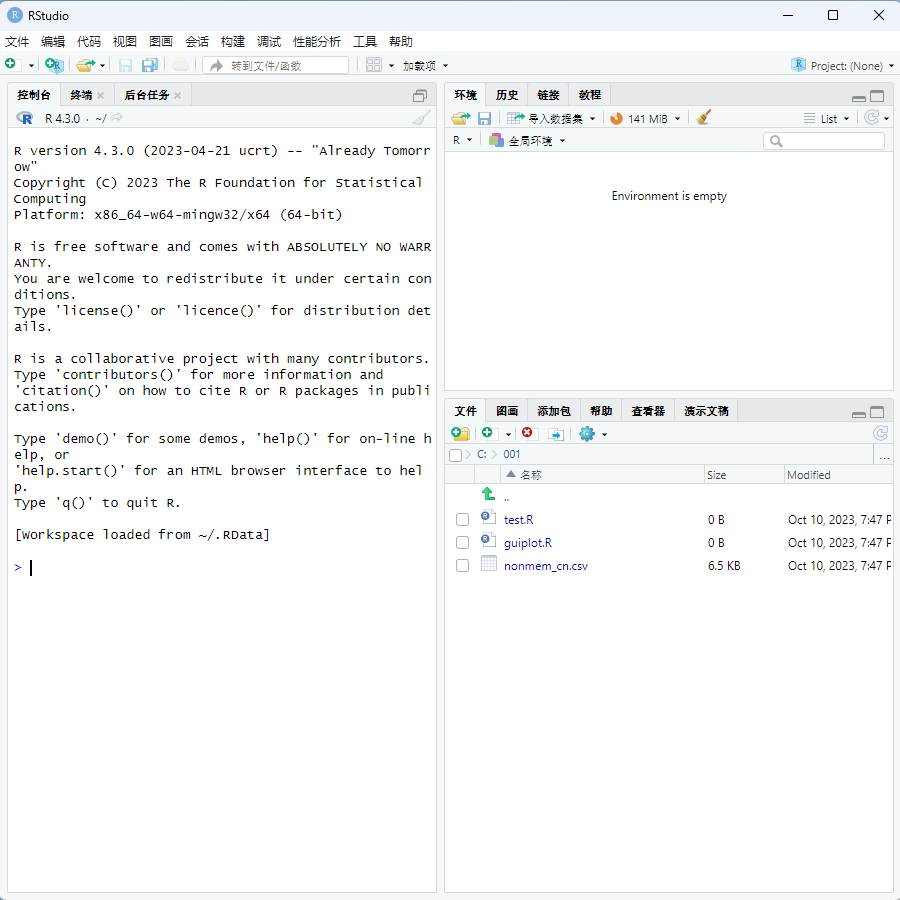
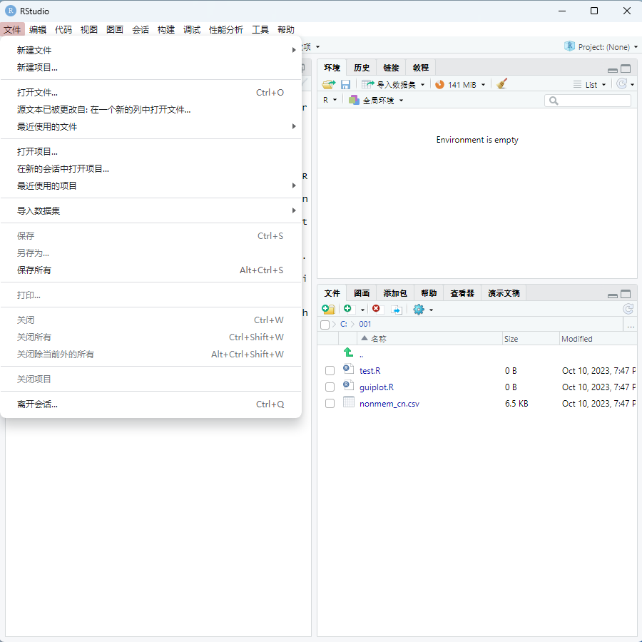
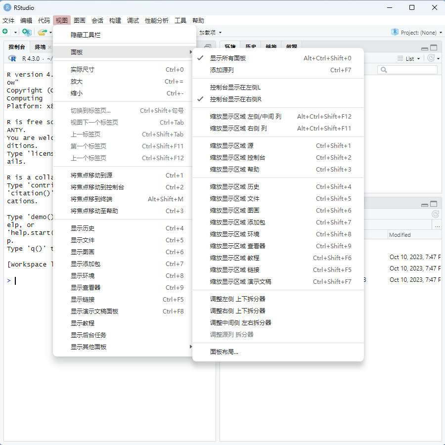
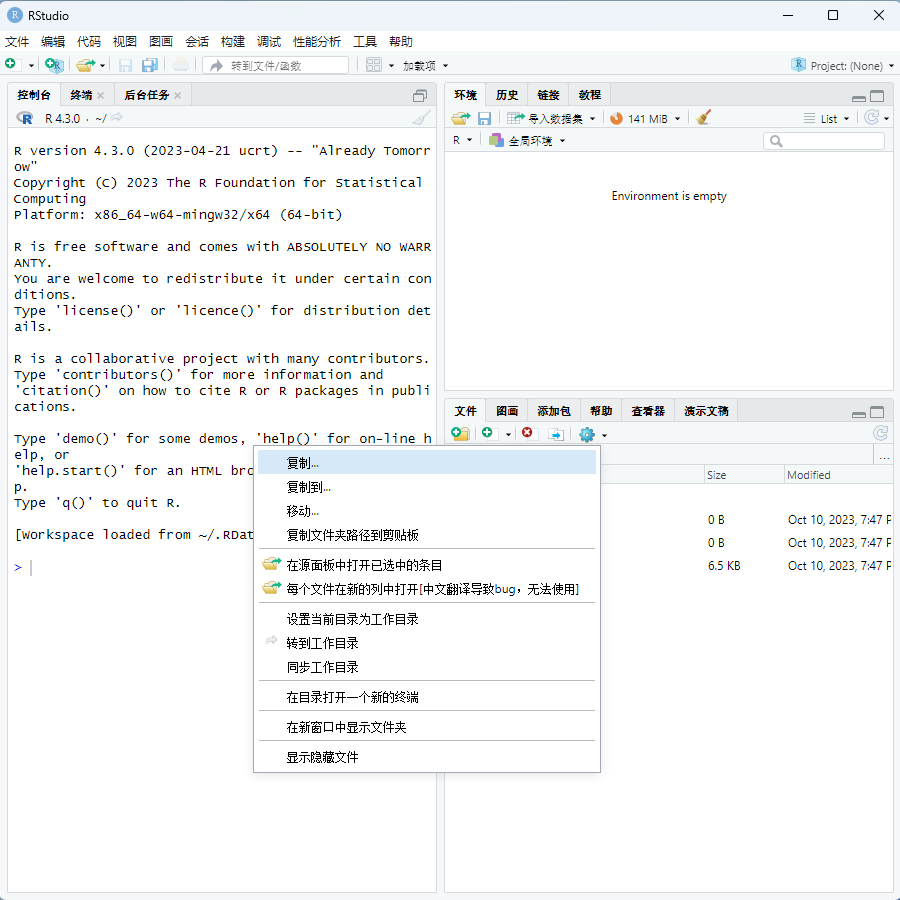
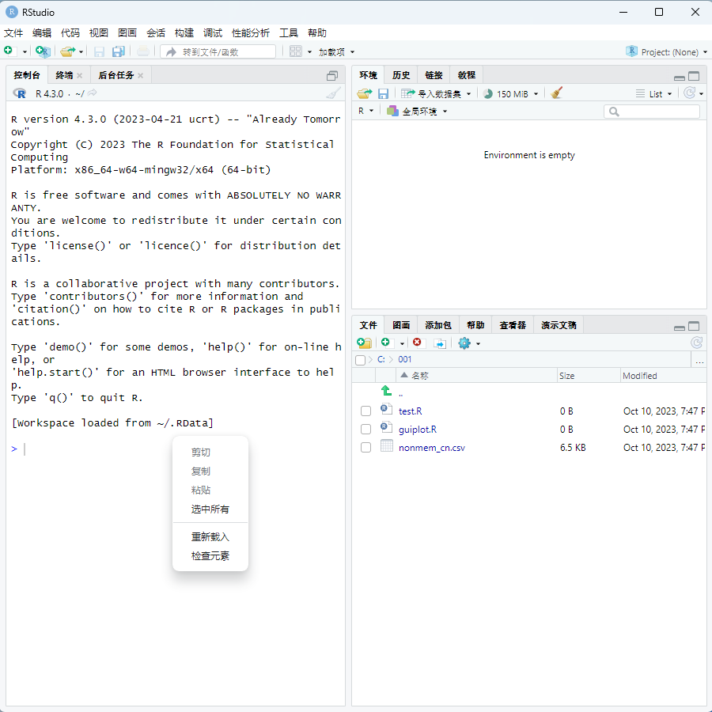
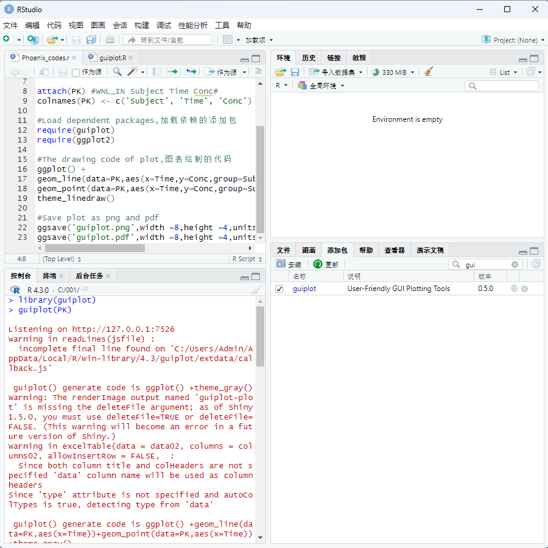

**RStudio用户界面中文汉化翻译介绍与使用说明**

# 引言

[RStudio](https://posit.co/download/rstudio-desktop/)是一个面向R语言的集成开发环境工具(IDE)程序,为[R语言](https://www.r-project.org/)新手提供了一些便利，与之类似的工具还有很多比如[Visual Studio Code](https://code.visualstudio.com/)、[R AnalyticFlow](https://r.analyticflow.com/en/)、[BlueSky Statistics](https://www.blueskystatistics.com/)、[JASP](https://jasp-stats.org/)等。但这些工具除了VSCode外多只提供了英文版、法文、日文版用户界面，没有提供中文版的用户界面，这为使用中文作为主要语言的人群带来了学习和使用R程序语言的一些障碍，让大家容易望而却步，或者学习与使用起来糊里糊涂。因此，为了能够改善大家学习和使用R语言的环境，[作者](https://s0521.github.io/cn/vitae/)对RStudio的用户界面进行了翻译，将英文翻译为了简体中文，以便读者能够更好的使用RStudio这款工具。

# 正文

## 一、部分翻译后的RStudio用户界面截图

- 主界面

- 文件菜单

- 视图菜单

- 文件更多

- 右键菜单

- 代码编辑器与R添加包

## 二、简介

当前用户界面翻译**主要翻译**了以下**内容**：

- **顶部**-**菜单栏**中的几乎**所有菜单**
- **左下角**-控制台、终端、后台任务的部分内容
- **右下角**-文件、图画、添加包、帮助、查看器、演示文稿的大部分内容
- **右上角**-环境、历史、链接、教程的大部分内容
- **左上角**-代码文件编辑器的大部分内容
- **右键菜单**-几乎全部菜单

**未进行大量翻译的区域**：

全局选项(Global option)下的大部分内容

**适用于RStudio的以下版本**：

- [**2023.03.1** Build 446](https://download1.rstudio.org/electron/windows/RStudio-2023.03.1-446.exe)
- 其他版本未进行过测试，无法确认适用性

## 三、使用说明

当前版本的[RStudio](https://posit.co/download/rstudio-desktop/)软件使用了与[新版QQ](https://im.qq.com/pcqq/index.shtml)类似的[Electron](https://www.electronjs.org/zh/)技术实现，所以其用户界面相关的信息最终储存在安装目录下的JavaScript类型的文件中，所以对其中与主用户界面相关的两个js文件进行了修改，以此来实现汉化翻译。

假设你在Windows系统下采用RStudio的默认安装路径安装了RStudio，则这两个文件的路径如下：

C:\Program Files\RStudio\resources\app\.webpack\main\index.js

C:\Program Files\RStudio\resources\app\www\rstudio\7EA4A6E4E8493375F0C7C283A8C92A12.cache.js

将本翻译文件下的两个同名文件分别替换掉RStudio安装路径下的同名文件，即可实现汉化翻译。（替换前建议先备份保存原始的文件，以便必要时回滚会英文版界面）

## 四、参与并贡献

中英翻译是通过逐一查找用户界面的中的英文单词并翻译为对应中文的方式完成，这是一个很耗时的工作，你可以参与进来，贡献你的知识使得翻译更加完善。

在此翻译的github仓库为 https://github.com/s0521/rstudio_cn

## 五、已知问题

可能在成部分窗口打开出现问题。

## 六、未来计划功能

未来无进一步计划，坐等原厂自己启动国际化计划，以实现原厂级的中文版。